# 03_04 Create and test a webhook with GitLab

Follow the steps in this document to create a webhook that connects a Jenkins job to a GitLab repository.

The goal is to have push commits to the GitLab repository trigger the Jenkins job to check out the code and run build steps.

## Overview

1. Create a GitLab repo and an API token in GitLab that allows read access to a repository
2. Install the GitLab plugin to provide webhook functionality
3. Configure a Jenkins freestyle project that:
   1. Uses the GitLab repository for the SCM configuration
   2. Listens for push notifications from GitLab
4. Create a wehbook in GitLab that will notify Jenkins when a push event occurs on the repository

This challenge should take 15 to 20 minutes to complete.

## Instructions

### 1. Set Up GitLab

1. **Create a GitLab Repository**

   - Sign in to GitLab and create a **private repository**.
   - Ensure the repository includes a `README.md` file.

1. **Copy the Repository URL**

   - In the repository, select **Code**, then under **Clone with HTTPS** select the **clipboard icon** to copy the URL.

   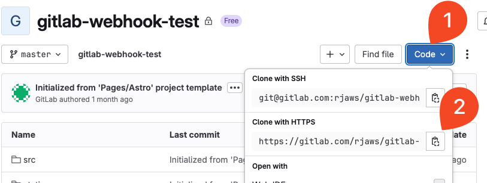

1. **Create an Access Token**

   - Go to **User Settings > Access Tokens**.
   - Create a new token with the following settings:

     - **Name**: Any descriptive name (e.g., `Jenkins Access`)
     - **Scopes**: Select **read_repository**
   - Copy and save the token somewhere safe—you will need it later.

   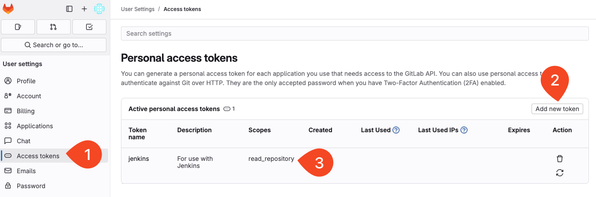

### 2. Configure Jenkins

1. **Install the GitLab Plugin**

   - Go to **Manage Jenkins > Plugins  > Available Plugins**.
   - Search for `gitlab-plugin`.
   - Select the checkbox next to the plugin and select **Install**.

   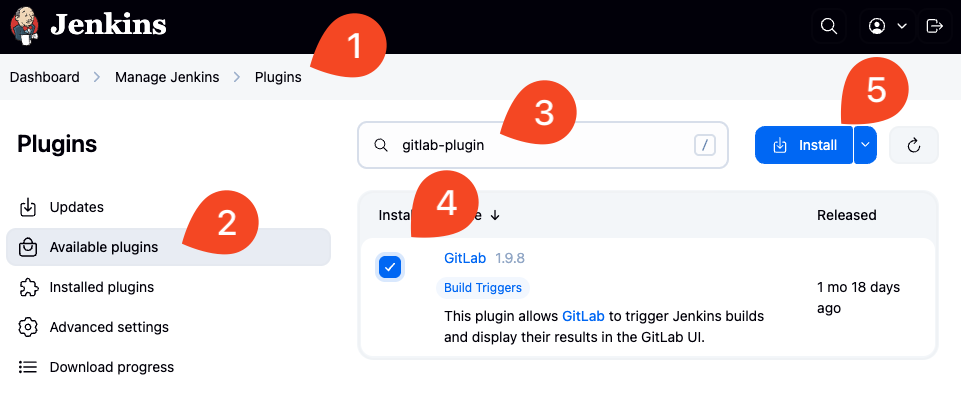

1. **Create a New Jenkins Job**

   - On the Jenkins dashboard, select **New Item**.
   - Enter a name for your project.
   - Choose **Freestyle project** and select **OK**.

1. **Set Up Source Code Management**

   - Under **Source Code Management**, select **Git**.
   - Paste the GitLab repository URL you copied earlier.
   - You will likely see an authentication error at this point.

   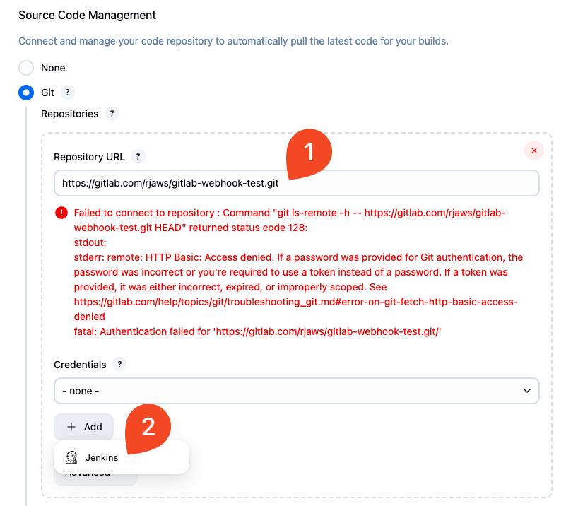

1. **Add GitLab Credentials**

   - select **Add > Jenkins** under the **Credentials** dropdown.
   - For **Kind**, select **Username with password**.
   - Enter your **GitLab username** and paste the **access token** into the password field.
   - select **Add**.

   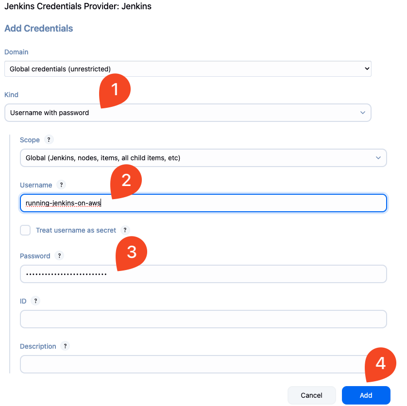

1. **Select Your Credentials**

   - Back under **Source Code Management**, select the new credentials you just added from the **Credentials** dropdown.

   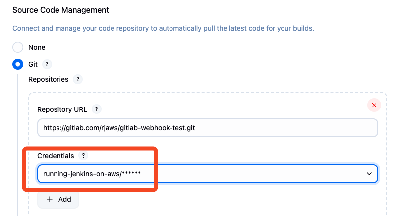

1. **Configure Branches**

   - Under **Branch Specifier**, change the value from `*/master` to `*/main`, or clear it entirely to allow builds on any branch.

1. **Enable GitLab Webhook Trigger**

    - Scroll to the **Build Triggers** section.
    - Check the box for **Build when a change is pushed to GitLab**.
    - Copy the **Webhook URL** shown on screen.

    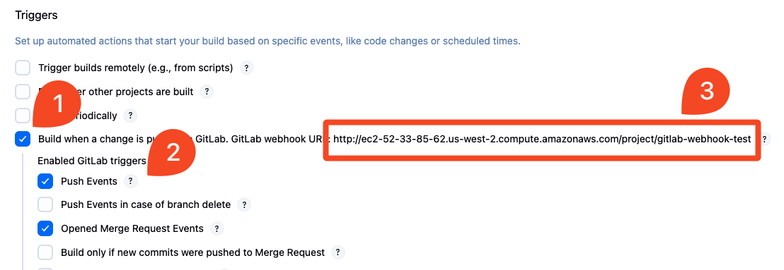

    - Select **Advanced**, scroll to the bottom, and select **Generate** to create a secret token.
    - Copy the **Secret Token** and save it along with the Webhook URL.

    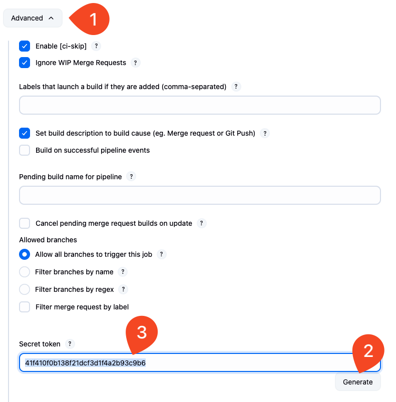

1. **Add a Build Step**

    - Scroll to **Build** and select **Add build > Execute shell**.
    - In the command field, enter:

      ```bash
      cat README.md
      ```

    - Select **Save** to finish creating the job.

    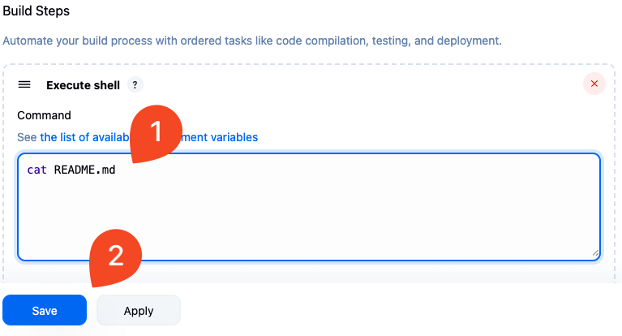

### 3. Create the Webhook in GitLab

1. **Add a Webhook**

    - In your GitLab repository, go to **Settings > Webhooks**.
    - Select **Add New Webhook**.

    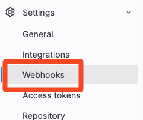

    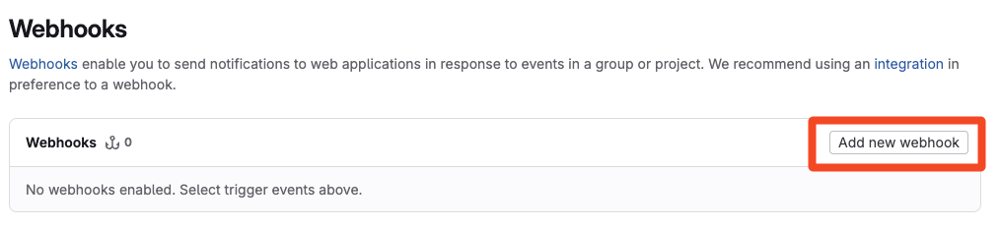

1. **Fill in Webhook Details**

    - **URL**: Paste the Jenkins Webhook URL.
    - **Secret Token**: Paste the token you copied from Jenkins.
    - **Trigger**: Select **Push events**.
    - (Optional) Disable SSL verification if your Jenkins server does not use HTTPS.
    - Select **Add Webhook**.

    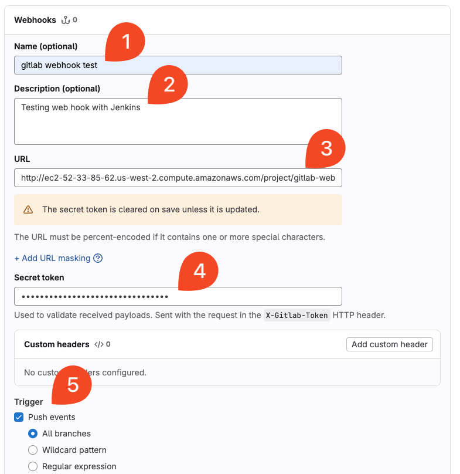

    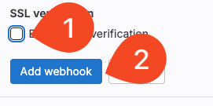

1. **Test the Webhook**

    - Select **Test > Push Events** to test the webhook connection.

    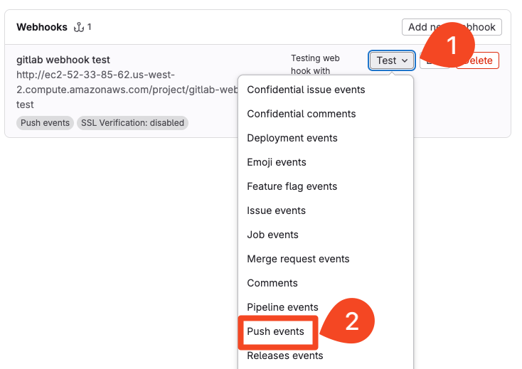

    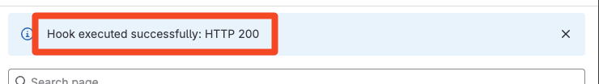

1. **Verify the Integration**

    - Make a small edit to the `README.md` file in GitLab.
    - Commit the change.

    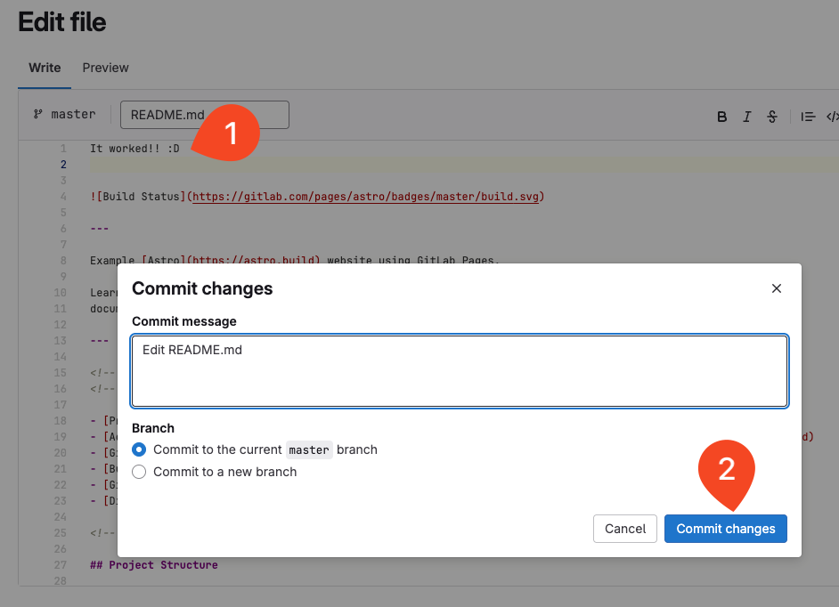

    - In Jenkins, open your project and view the **Console Output**.
    - Confirm that the build was triggered by the GitLab push event.

    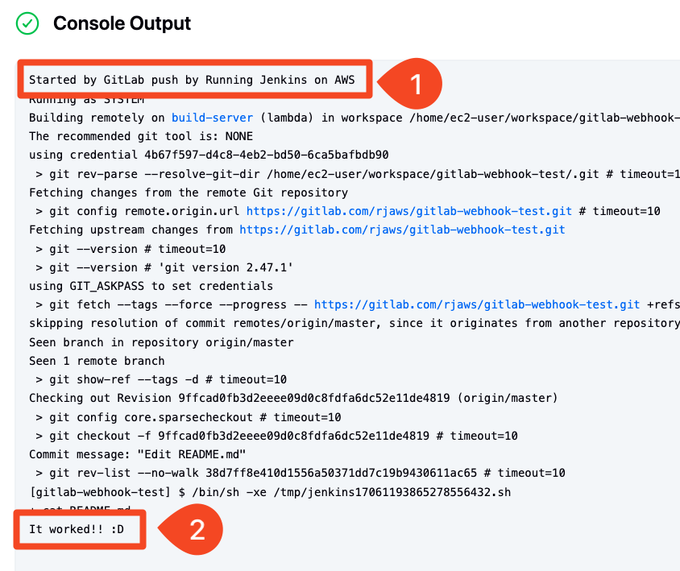

<!-- FooterStart -->
---
[← 03_03 Create and test a webhook with GitHub](../03_03_create_a_webhook_with_github/README.md) | [03_05 Create and test a webhook with Bitbucket →](../03_05_create_a_webhook_with_bitbucket/README.md)
<!-- FooterEnd -->
