# 03_08 Create and test a webhook with Bitbucket

Follow the steps in this document to create a webhook that connects a Jenkins job to a Bitbucket repository.

The goal is to have push commits to the Bitbucket repository trigger the Jenkins job to check out the code and run build steps.

## Overview

1. Create a Bitbucket repo and an access token that allows read access to a repository
1. Install the Bitbucket Push and Pull Request plugin to provide webhook functionality
1. Configure a Jenkins freestyle project that:
   1. Uses the Bitbucket repository for SCM
   1. Listens for push notifications from GitLab
1. Create a wehbook in Bitbucket that will notify Jenkins when a push event occurs on the repository

This challenge should take 15 to 20 minutes to complete.

## Instructions

### 1. Create Bitbucket Repository and Access Token

1. Log in to your Bitbucket account.
1. Create a new repository:

   - Assign it to a project.
   - Give it a unique name.
   - Set the access level to **Private**.
   - Enable the option to include a **README** file.
   - Set the default branch name to `main`.
   - Select **Create Repository**.

   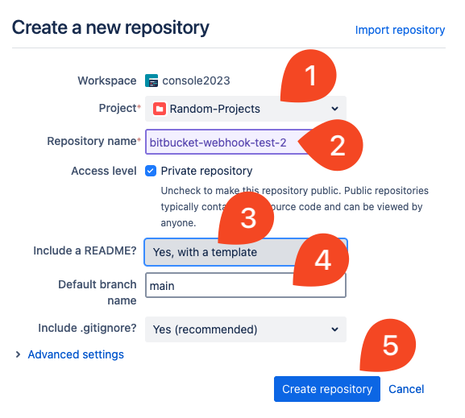

1. Once created:

   - Select **Clone**, select **HTTPS**, and copy the URL.
   - Paste the URL into a document for later use.
   - **Edit the URL**: remove the username and `@` symbol from the URL.

   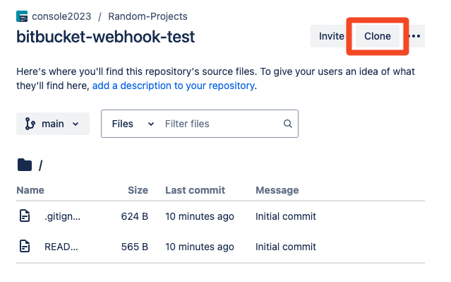
   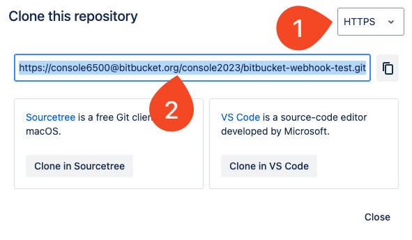

1. Create an access token:

   - Go to **Repository Settings** > **Access Tokens** (under the Security section).
   - Select **Create access token**.
   - Provide a name for the token.
   - Under **Scopes**, check **Read access** for repositories.
   - Select **Create** and **copy** the generated token.
   - Save the token and the modified repository URL somewhere safe for later use.

   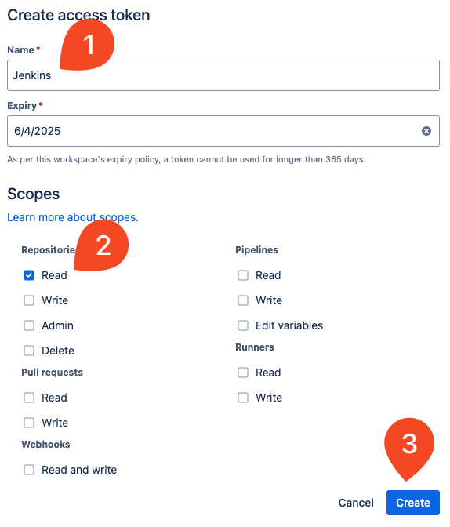
   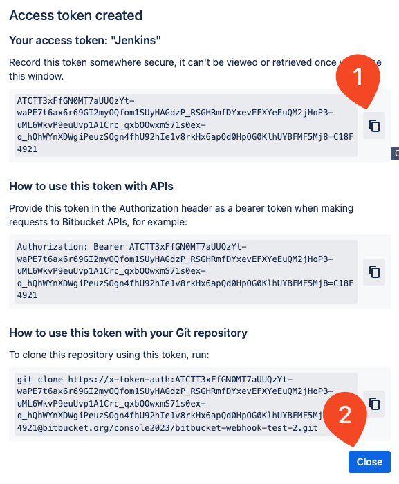

### 2. Install Plugin and Create a Jenkins Freestyle Project

1. In Jenkins, go to **Manage Jenkins** > **Plugins** > **Available Plugins**.
1. Search for **Bitbucket Push and Pull Request**.
1. Check the box next to the plugin and select **Install**.

   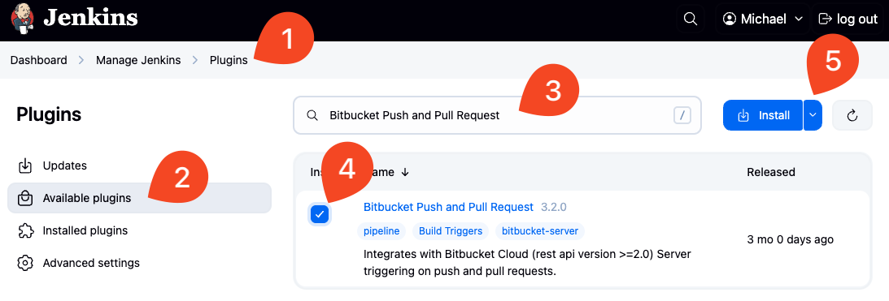

1. Once installed, return to the Jenkins dashboard and select **New Item**.
1. Enter a name for your job, select **Freestyle Project**, and select **OK**.

**Configure Source Code Management:**

1. Under **Source Code Management**, select **Git**.
1. Paste the modified repository URL (without username and `@`) into the **Repository URL** field.

   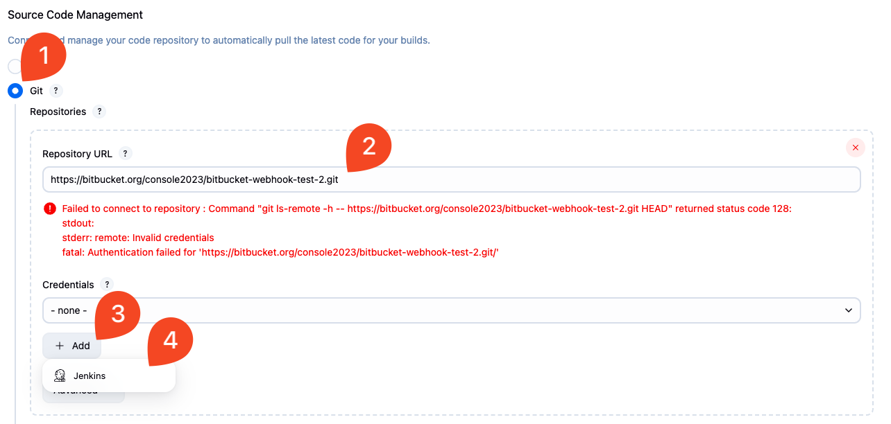

1. Add credentials to solve the authentication error:

   - Select **Add** next to **Credentials** and choose **Jenkins**.
   - For **Kind**, select **Username and Password**.
   - Username: enter `x-token-auth`.
   - Password: paste the access token.
   - Description: use your Bitbucket username.
   - Select **Add**.

    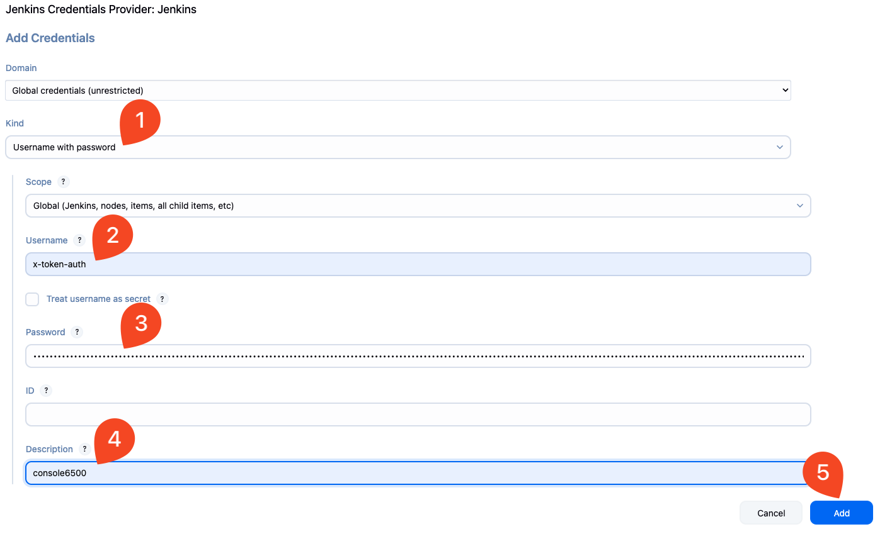

1. Back in the job configuration, select the credential you just added from the **Credentials** dropdown.  Confirm the authentication error is resolved.
1. Change the **Branch Specifier** from `master` to `main`.

    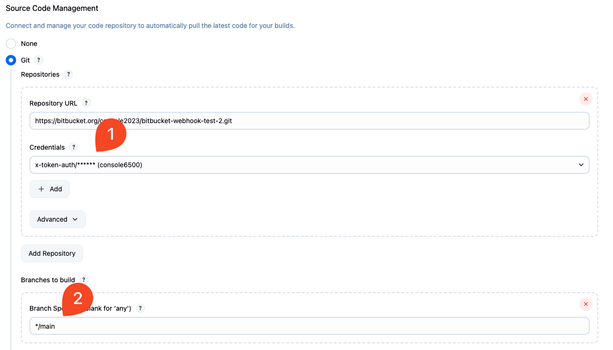

**Configure Triggers and Build Steps:**

1. Scroll down to **Build Triggers**.

    - Check the box for **Build with BitBucket Push and Pull Request Plugin**.
    - Select **Push** under trigger types.

    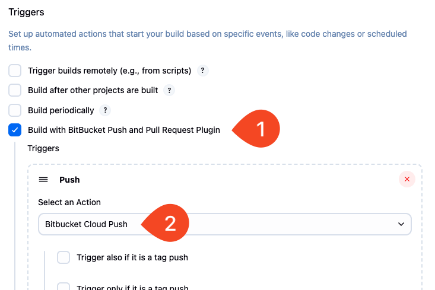

1. Scroll to **Build** and select **Add build step** > **Execute shell**.

    - Enter the following command:

        ```bash
        cat README.md
        ```

    - Select **Save** to finalize the job configuration.

    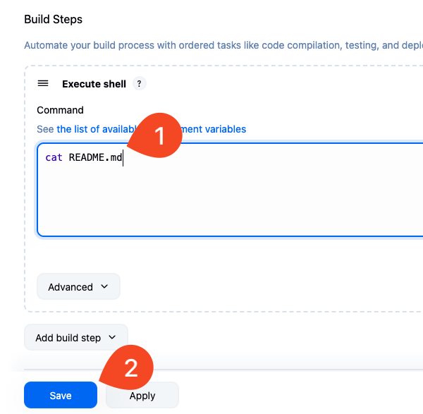

1. Copy the Jenkins server URL by selecting the icon in the top right, right-click and select **Copy link address**.

   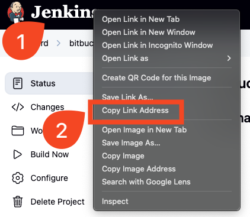

### 3. Create a Webhook in Bitbucket

1. Return to the Bitbucket repository.
1. Go to **Repository Settings** > **Webhooks** > **Add Webhook**.

   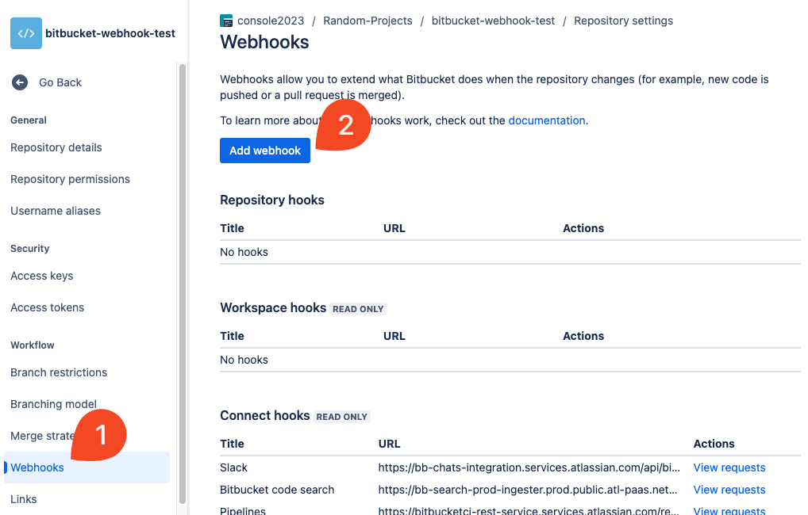

1. Fill out the webhook form:

   - Title: enter a descriptive name like "Trigger Jenkins Build".
   - URL: paste your Jenkins URL, followed by `/bitbucket-hook/`. _*NOTE: this part is critical for the webhook to work properly.  If the path is incorrect or the trailing slash is missing, the webhook may fail.*_

        ```bash
        Example: `http://jenkins.example.com/bitbucket-hook/`
        ```

   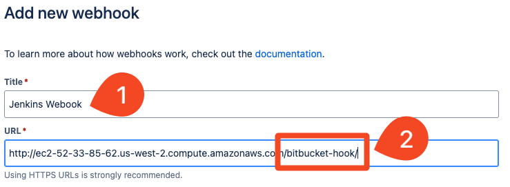

   - Under **SSL/TLS**, check **Skip certificate verification** (if Jenkins is using HTTP).
   - Under **Triggers**, check **Push**.
   - Select **Save**.

   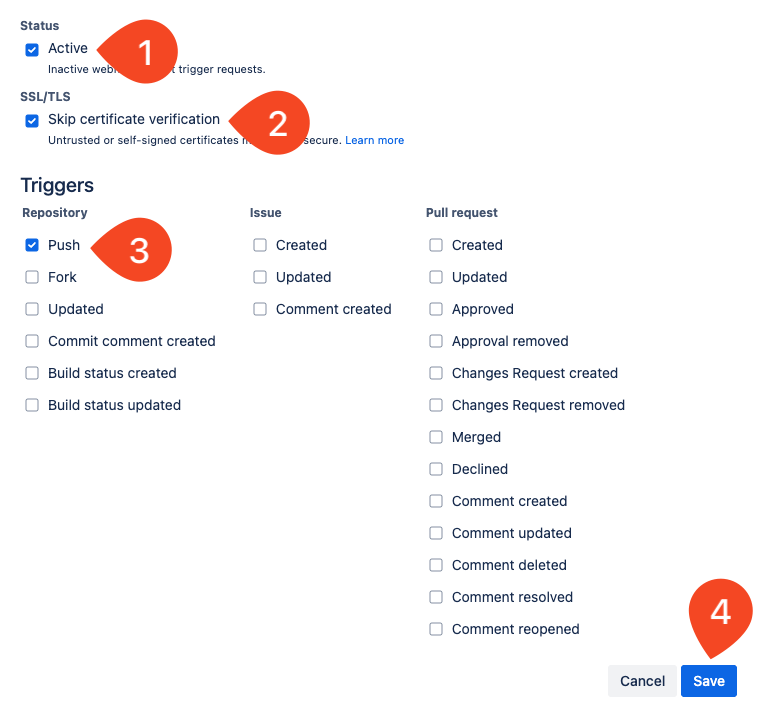

### 4. Test the Webhook

1. Go back to the repository code view and open the **README.md** file.
1. Select **Edit**, make a small change, and **commit** the update to the `main` branch.

   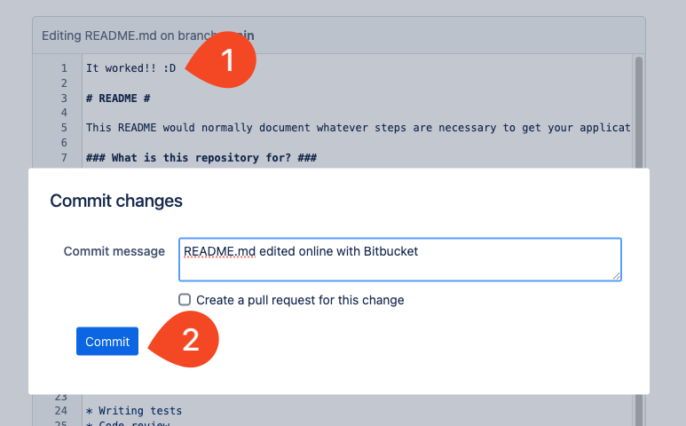

1. In Jenkins, check your freestyle job:

   - Confirm that a new build starts automatically.
   - Wait for the build to complete.

1. Select the build number, then **Console Output**:

   - Verify that the build was triggered by the Bitbucket webhook.
   - Confirm that the correct repository URL was used.
   - Check that your changes appear in the output of the `cat README.md` step.

   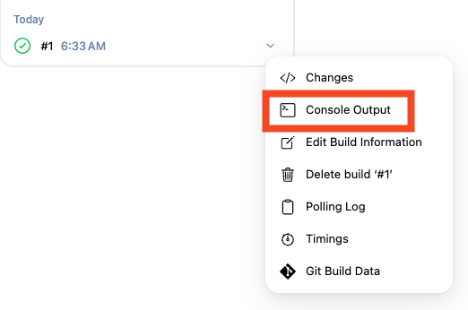
   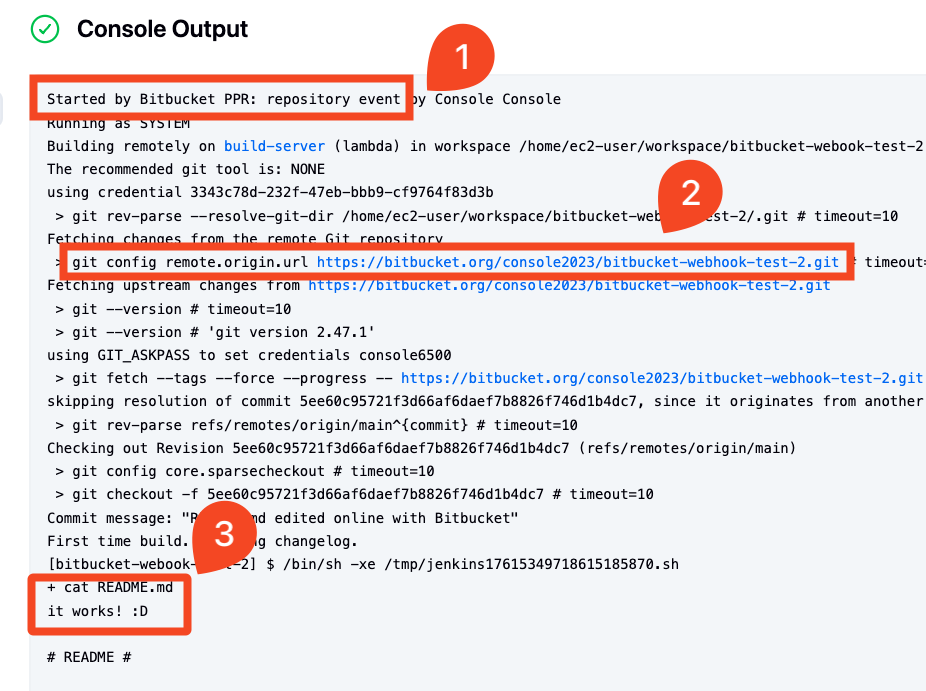

## References

- [Bitbucket Documentation: Manage webhooks](https://support.atlassian.com/bitbucket-cloud/docs/manage-webhooks/)

- [Bitbucket Push and Pull Request Plugin](https://plugins.jenkins.io/bitbucket-push-and-pull-request/)

<!-- FooterStart -->
---
[← 03_07 Create and test a webhook with GitLab](../03_07_create_a_webhook_with_gitlab/README.md) | [04_01 Plan the Deployment Target in AWS Lambda →](../../ch4_deploy_code_to_aws_lambda/04_01_plan_the_deployment_target_in_aws_lambda/README.md)
<!-- FooterEnd -->
